# **Documentation for DataCoder AI**  
**Last Updated**: 2025-04-12  

---

## **1. Introduction**  
**DataCoder AI** is a web-based interactive data analysis tool that combines:  
- **Data Analysis Python Coder**  
- **AI-powered code generation** (via Groq API)  
- **Data visualization**  
- **Chat-based coding assistance**  

Built with `Streamlit`, `Pandas`, and `Plotly`, designed for **data scientists** and **analysts**.  
Here are the **required libraries** for your DataCoder AI application, extracted from your code:

---

### **Core Dependencies**  
**Install via `pip install -r requirements.txt`:**
```text
streamlit==1.32.0        # Web UI framework
pandas==2.0.0           # Data manipulation
matplotlib==3.7.0       # Basic visualization
seaborn==0.12.2         # Advanced plots
plotly==5.18.0          # Interactive charts
requests==2.31.0        # API calls (Groq)
langchain==0.1.0        # LLM interface (if used)
python-dotenv==1.0.0    # Environment variables
```

### **Optional/Implicit Dependencies**  
```text
numpy==1.24.0           # (Auto-installed with pandas)
scipy==1.10.0           # (For stats operations)
fuzzywuzzy==0.18.0      # (For column name matching - if used)
```

---

### **Notes**:  
1. **Groq API**: No Python SDK required (uses raw `requests`).  
2. **Virtual Environment**: Recommended to avoid conflicts:  
   ```bash
   python -m venv venv
   source venv/bin/activate  # Linux/Mac
   venv\Scripts\activate    # Windows
   pip install -r requirements.txt
   ```

3. **Production Considerations**:  
   - Add `gunicorn` for deployment:  
     ```text
     gunicorn==20.1.0
     ```  
   - For Windows, use `waitress`:  
     ```text
     waitress==2.1.2
     ```
---

## **2. System Architecture**  

### **2.1 Component Diagram**  

```mermaid
flowchart TD
    subgraph UserLayer["🔵 User Layer"]
        U[User] -->|"1. Upload File/Code & Interaksi"| W["🌐 Streamlit Web Interface"]
        W -->|"8. Tampilkan Hasil"| U
    end

    subgraph HuggingFaceSpace["🟢 Hugging Face Space Container"]
        subgraph Frontend["🖥️ Frontend (Streamlit)"]
            F1["📤 File Uploader Component"] 
            F2["⌨️ Code Editor Component"]
            F3["📊 Output Display Component"]
        end

        subgraph Backend["⚙️ Backend Services"]
            B1[["📁 Data Processor
            (Validasi & Parsing Data)"]]
            B2[["🐍 Code Executor
            (Sandboxed Environment)"]]
            B3[["🤖 Groq API Client
            (API Handler + Auth)"]]
            B4[["💾 Session State Manager"]]
            B5[["♻️ Cache System"]]
            B6[["🚨 Error Handler"]]
        end

        subgraph HFInfra["🔧 Hugging Face Infrastructure"]
            H1["🔑 Secret Storage (API Keys)"]
            H2["📦 Dependency Manager (requirements.txt)"]
            H3["📈 Resource Monitor (CPU/Memory)"]
        end

        F1 -->|"2. Raw Data"| B1
        F2 -->|"3. Kode Input"| B2
        B2 -->|"4. Eksekusi & Hasil Awal"| B4
        B2 -->|"5. LLM Request"| B3
        B3 -->|"6. Ambil API Key"| H1
        B3 -->|"7a. API Call"| G[Groq Cloud]
        G -->|"7b. LLM Response"| B3
        B3 -->|"Proses Response"| B1
        B1 -->|"Data Terproses"| F3
        B4 -->|"State Management"| F3
        B5 -->|Cache Request| B3
        B6 -->|Handle Errors| ALL[" "]
    end

    subgraph External["🔴 External Services"]
        G
        CDN["🌍 Hugging Face CDN"]
    end

    W -->|HTTPS| CDN
    CDN -->|Reverse Proxy| HuggingFaceSpace
    HuggingFaceSpace -->|Rate Limiting| CDN

    style HuggingFaceSpace fill:#f0f9ff,stroke:#2563eb,stroke-width:2px
    style UserLayer fill:#e6f7ff,stroke:#1e88e5
    style External fill:#fee,stroke:#dc2626
    style HFInfra fill:#f5f5f5,stroke:#666

    classDef important fill:#ffd700,stroke:#000,stroke-width:2px
    class B3,H1 important
```


### **2.2 Data Flow**  
1. **Input**: CSV files → Pandas DataFrame  
2. **Processing**: Merge/clean data → Modified DataFrame  
3. **Execution**: Python code → Results (text/plots/variables)  
4. **Output**: Visualizations + Export files  

---

## **3. Installation**  

### **3.1 Prerequisites**  
- Python 3.8+  
- `pip` package manager  

### **3.2 Setup**  
```bash
# Clone repository
git clone https://github.com/yourrepo/datacoder-ai.git
cd datacoder-ai

# Install dependencies
pip install -r requirements.txt

# Run the app
streamlit run app.py
```

### **3.3 Configuration**  
Rename `.env.example` to `.env` and add your Groq API key:  
```env
GROQ_API_KEY=your_api_key_here
```

---

## **4. User Guide**  

### **4.1 Data Upload**  
1. Click **"Upload CSV file(s)"**  
2. Select 1+ CSV files  
3. Configure merge options:  
   - **Horizontal**: Combine columns (align by index)  
   - **Vertical**: Stack rows  

### **4.2 Data Cleaning**  
| Feature          | How to Use                              |
|------------------|----------------------------------------|
| Handle NaN       | Select: Keep/Remove/Fill with mean     |
| Remove Duplicates| Choose: Keep first/last/all            |
| Rename Columns   | Enter: `old_name:new_name`             |
| Drop Columns     | Enter comma-separated column names     |

### **4.3 Code Execution**  
#### **Auto-Run Mode**  
1. Type request (e.g., "Plot sales distribution")  
2. Click **▶️ Execute** → AI generates and runs code  

#### **Manual Mode**  
1. Write/edit Python code  
2. Click **▶️ Execute**  

### **4.4 Chat Assistant**  
Ask questions like:  
- _"How to normalize this data?"_  
- _"Explain the output of this code"_  

---

## **5. API Reference**  

### **5.1 Core Functions**  
#### `execute_code(code: str, df: pd.DataFrame) -> dict`  
**Parameters**:  
- `code`: Python code to execute  
- `df`: Target DataFrame  

**Returns**:  
```python
{
    "success": bool,
    "stdout": str,       # Console output
    "figure": Figure,     # Matplotlib plot
    "variables": dict     # New variables created
}
```

#### `analyze_code_execution(code: str, execution_result: dict, df: pd.DataFrame) -> str`  
Generates natural language analysis of results in **Indonesian**.  

### **5.2 LLM Classes**  
#### `GroqLLM()`  
- **Model**: `qwen-2.5-coder-32b`  
- **Temperature**: 0.3  
- **Purpose**: Code generation  

#### `GroqTextLLM()`  
- **Model**: `deepseek-r1-distill-llama-70b`  
- **Temperature**: 0.7  
- **Purpose**: Chat explanations  

---

## **6. Examples**  

### **6.1 Sample Workflow**  
```python
# AI-Generated Code Example (Auto-Run)
import matplotlib.pyplot as plt
plt.figure(figsize=(10, 6))
df['sales'].plot(kind='hist', bins=20)
plt.title('Sales Distribution')
plt.show()
```

### **6.2 Expected Output**  
1. Histogram plot rendered  
2. Console output:  
   ```text
   Plot generated for column: sales
   ```

---

## **7. Troubleshooting**  

| Issue                          | Solution                               |
|--------------------------------|----------------------------------------|
| Groq API errors                | Check quota/network connection        |
| CSV parsing fails              | Verify delimiter (use `delimiter=';'`)|
| Plot not showing               | Ensure `plt.show()` is called         |

---

## **8. License & Contribution**  
- **License**: MIT  
- **Contribute**: Fork + PRs welcome  

---

**Notes for Production**:  
1. Replace hardcoded API keys with environment variables  
2. Add user authentication for multi-user support  
3. Implement rate limiting for Groq API calls  
